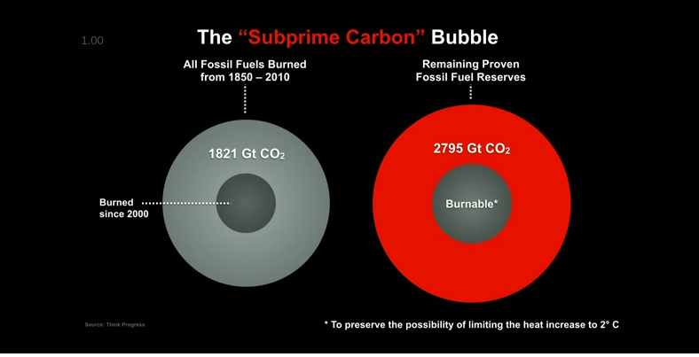
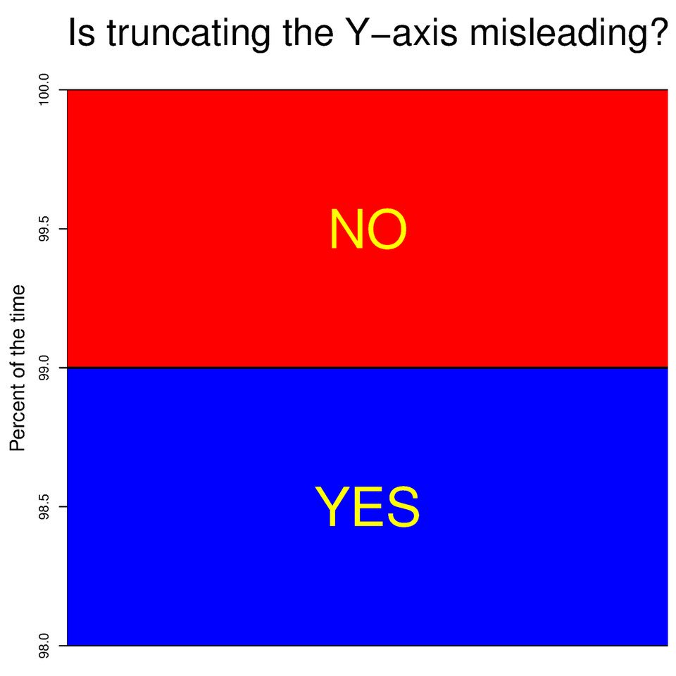

## Circles

Circles are bad for representing numbers as their area doubles with only a
$\sqrt{2}$ increase of the radius:

Image Source: [NZZ Neue Zürcher Zeitung](https://www.facebook.com/nzz/)

Image Source: [Al Gore/TED 12:15](http://www.ted.com/talks/al_gore_the_case_for_optimism_on_climate_change#t-733372)

Incidentally, this is the reason why you should refrain from using [pie charts](http://www.businessinsider.com/pie-charts-are-the-worst-2013-6?IR=T) in most scenarios.

## Axes

Image Source: [reddit.com/r/dataisbeautiful](https://www.reddit.com/r/dataisbeautiful/comments/62v3na/data_irl/)

## Other things terribly visualised
For more terrible data visualisations, see [WTF Visualisations](http://viz.wtf/)
